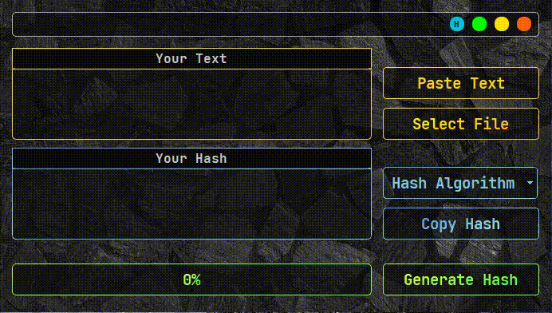

# Hash_Generator
Hash Generator written with Python and PyQt5, for making  hash just paste your text and press the generate hash button.


# Requires

```bash
  pip install PyQt5
```
```bash
  pip install pyperclip
```
# Usage/Examples
<kbd>
 
</kbd>


# Author
- Github: [@Aminjjjeffrey](https://github.com/Aminjjjeffrey)
- Twitter: [@Aminjjjeffrey](https://twitter.com/Aminjjjeffrey)


